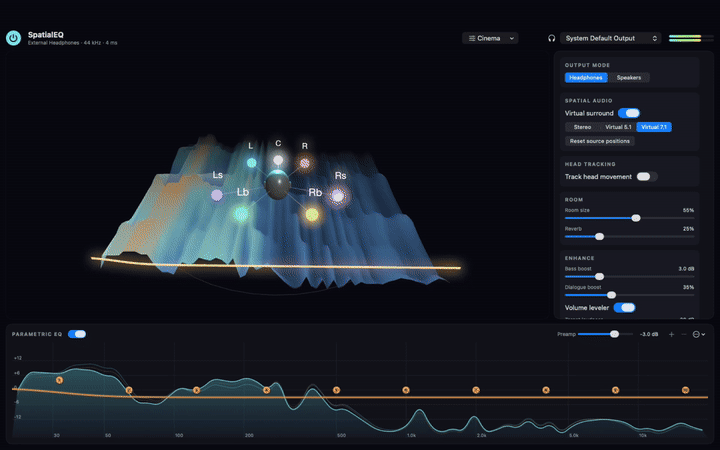
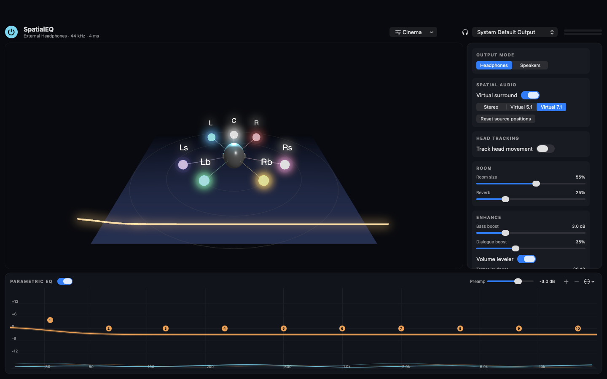
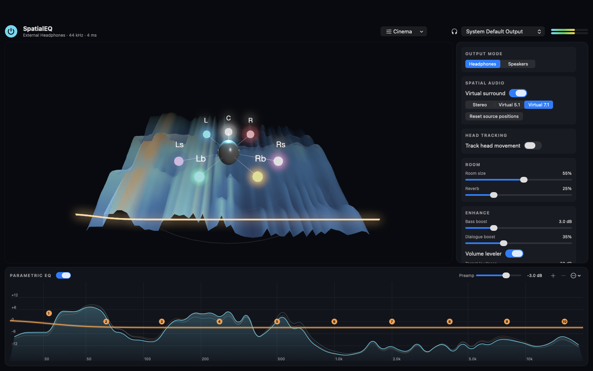

# SpatialEQ

[](https://github.com/Savannah-DSP/SpatialEQ/actions/workflows/ci.yml)

**Parametric EQ and spatial audio with an interactive 3D scene, for macOS, Android and iOS.**

By [Savannah DSP](https://savannahdsp.com) · v1.0.0 · macOS 14.2 or later · Apple silicon and Intel



▶ [Full-resolution 360° video (MP4)](docs/spatialeq-360.mp4)

| Idle | Playing |
|---|---|
|  |  |

## Install

1. Download **`SpatialEQ-1.0.0.pkg`** (installer) or **`SpatialEQ-1.0.0.dmg`** (drag to Applications) from the [latest release](https://github.com/Savannah-DSP/SpatialEQ/releases/latest).
2. Open it. This first release is not notarized by Apple, so macOS will block it the first time. Go to **System Settings → Privacy & Security**, scroll down and click **Open Anyway**.
3. Launch SpatialEQ and click **Allow** when macOS asks for **System Audio Recording**. SpatialEQ needs this to process the sound from your other apps. Audio is processed on your Mac and never recorded or sent anywhere.

To uninstall, quit SpatialEQ from its menu bar icon and delete it from Applications. Quitting returns your Mac's audio to normal immediately.

## Features

- **Works with every app:** Music, Spotify, browsers, games and video calls all go through SpatialEQ. Pick any output device: wired or Bluetooth headphones, built-in speakers, or external speakers.
- **Parametric EQ:** up to 16 bands (peak, shelf, low-pass and high-pass) with a preamp. Drag the handles and scroll over one to change its Q. Import headphone correction profiles from [AutoEq](https://github.com/jaakkopasanen/AutoEq) or Equalizer APO, and export your own.
- **Virtual surround for headphones:** stereo, 5.1 or 7.1 binaural rendering. Every virtual speaker can be dragged around your head in 3D, and ⌥-drag changes its height.
- **Head tracking** with AirPods (3rd gen, Pro, Max) and supported Beats: sound sources stay put when you turn your head.
- **Speaker mode:** stereo widening and crosstalk cancellation for a wider image from laptop and desktop speakers.
- **Enhancements:** room simulation, bass boost, Dialogue Boost, Volume Leveler and a look-ahead limiter.
- **Presets and per-device memory:** 12 built-in presets plus your own. Each output device remembers its sound.
- **Live 3D view:** a spectrum terrain, the EQ curve and your sound sources, with orbit, zoom and tilt. Quick controls live in the menu bar.

## How it works

SpatialEQ uses a Core Audio process tap (macOS 14.2+), so no audio driver is installed. It mutes every app's original output, processes the mix and plays the result to your chosen device:

```
apps ──(muted system tap)──▶ private aggregate device ──▶ DSP engine (C++) ──▶ output device
```

The signal chain is: preamp → dialogue → bass → (binaural renderer | widening + crosstalk cancellation) → room → EQ → leveler → output gain → limiter.

The EQ comes after the spatial stage so that headphone correction applies to exactly what reaches your ears. The real-time engine never allocates memory or takes locks on the audio thread, and it runs about 70× faster than real time with every feature enabled.

## Platforms

| Platform | What it does | Status |
|---|---|---|
| **macOS** 14.2+ | System-wide: every app, every output device (Core Audio taps) | Released (v1.0.0) |
| **Android** 10+ | System-wide: every app that allows audio capture, with per-app on/off switches | In testing |
| **iOS** 17+ | Music player for your own files with the full EQ, virtual surround and head tracking. iOS doesn't let apps process other apps' audio. | In development |
| **Windows** | Planned: audio-engine plug-in (APO) | Planned |

All platforms share one C++ DSP core (`DSP/`), so sound and presets are identical everywhere.

### Android system-wide setup

Android needs two things to process other apps:
- **Every time:** tap **Start** and accept the screen-capture prompt. Android's "capture other apps' audio" feature runs through this prompt.
- **Once, optional but recommended:** grant one permission from a computer so SpatialEQ can find every app's audio:

```bash
adb shell pm grant com.savannahdsp.spatialeq android.permission.DUMP
```

Apps that block audio capture, such as some streaming apps, keep their original sound.

## Build from source

```bash
brew install xcodegen cmake
macos/scripts/build.sh                     # DSP unit tests + macOS Release build
macos/scripts/package.sh                   # macOS .pkg and .dmg in macos/build/release
cd ios && xcodegen generate                # iOS project (open SpatialEQ-iOS.xcodeproj)
cd android && ./gradlew assembleRelease    # Android APK (needs the Android SDK + NDK 28)
```

| Path | Contents |
|---|---|
| `DSP/` | C++17 real-time engine, FIFO, spectrum analyser, C API and unit tests |
| `shared/Swift/` | Settings, presets, AutoEq, analyser, head tracking and 3D scene shared by macOS and iOS |
| `macos/` | macOS app (Core Audio tap routing, menu bar, installer scripts) |
| `ios/` | iOS player app |
| `android/` | Android app (Kotlin + Compose, JNI to the DSP core) and a test-player helper |
| `.github/workflows/` | CI on every push (DSP tests on Linux/macOS/Windows, macOS/iOS/Android builds); tagged releases publish installers |

### Releases

Push a version tag to build every platform and publish a GitHub Release with the installers attached:

```bash
git tag v1.1.0 && git push origin v1.1.0
```

## Notes

- SpatialEQ is not affiliated with Dolby Laboratories and does not use Dolby technology.
- Some DRM-protected playback may not be capturable by macOS taps.
- With AirPods, turn off Apple's own Spatial Audio in Control Centre while using SpatialEQ's virtual surround.

© 2026 [Savannah DSP](https://savannahdsp.com)
